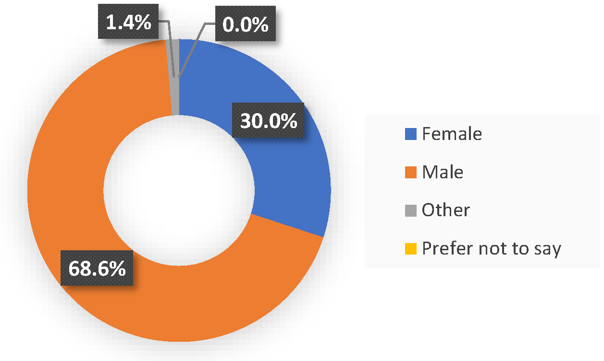
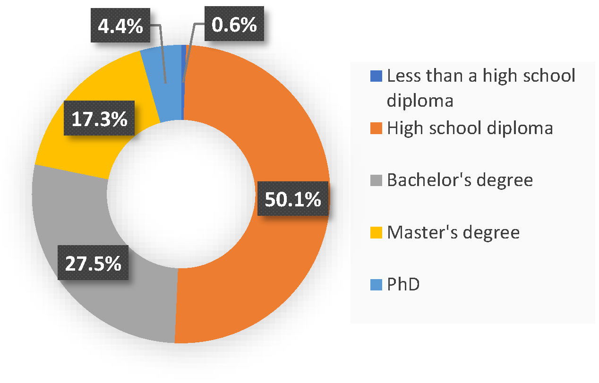
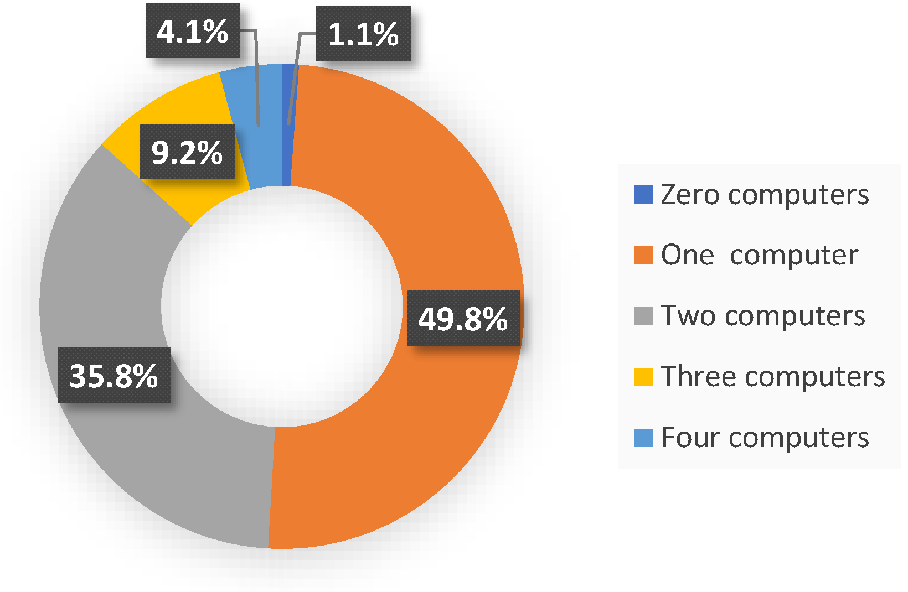

# Personal Computer Survey

## Introduction

Every year, hundreds of million units of personal computers are  manufactured worldwide. These computers are highly underutilized both in industries and in households. The extra computational capacity that lies in this vast pool of resources can be used towards distributed computing. This personal computer survey aims to find how efficient personal computers are being used. In other words, our goal is to determine how much excess computational power personal computers have that can be used towards the establishment of an open and public distributed computing platform. 

In 2005, Domingues et al. [[1]](#1) studied the resource usage of Windows 10 machines from classroom laboratories. The results show an average CPU idleness of 97.9\%. Although this study shows much wasted computational capacity, it focuses only on laboratory computers, and it was conducted about 15 years ago. Therefore, to provide stronger support for the idleness assumption, we have conducted a survey and asked participants to report their computer's CPU utilization and unused memory when running their regular programs. 

## Overview of the Survey

In this survey, we first gathered some demographic information about the
participant, such as their age, gender, and level of education. The rest
of the survey questions were aimed to find the amount of computational
power that is not being used. The participants first state the number of
personal computers that they own. Then they answer the following
questions for each of their computers:

-   On average, how many hours per day do you work with your personal
    computer?

-   What is the primary operating system that you use on your computer?

-   What is your computer's average CPU utilization when running regular
    programs?

-   What is the amount of unused memory, in gigabytes, on your computer
    when running regular programs?

About 700 people participated in this survey, mostly university students
of computer science or computer engineering.
The following figures show the demographic information of the
participants. Most of them are 20 - 29 years old, male, with a high
school diploma. In total, we gathered information about the utilization
of about 1150 computers.

## Results

Participants have been asked to indicate the number of personal
computers that they own. The following figure shows the results of this question. About half of the participants have one PC. The average number of personal computers that a person owns is 1.65.

To get a better understanding of the gathered data, the average usage
time per day, CPU utilization, and unused memory of the participants'
main computer for the education groups and age groups are shown in
the following two figures. Since there were less than 10
participants with an education level of less than a high school diploma,
it was not possible to calculate a reliable average value for this
group. The situation is similar for the age groups of 50-59 years old,
and 60 years and older.

It is also interesting to see the popularity of different operating
systems among the participants. About 73.8% of the computers are running
on Windows, which shows the popularity of this operating system. 16.6%
run on macOS, 8.4% on Linux, and the remaining 1.2% run on other
operating systems.

Finally, the following table shows the average usage time per day,
CPU utilization, and unused memory for the main computers and all the
computers in the survey. It can be seen that the average CPU utilization
for all the personal computers in this survey is 24.54%. Since most
participants are computer engineering and computer science students, the
average CPU utilization for a more general audience is expected to be
even less than this number. This result confirms our initial assumption
that personal computers are highly underutilized.

|               | Time (Hours) | CPU (%) | Memory (GBs) |
| ------------- | :-------------: | :-------------: | :-------------: |
| Main Computers  | 6.34  | 25.72 | 8.6 | 
| All Computers  | 4.53  | 24.54 | 7.91|

## References
<a id="1">[1]</a> 
Domingues,  P.  Marques,  and  L.  Silva,  “Resource  usage  of  windows computer  laboratories,”  in 2005 International Conference on Parallel Processing Workshops (ICPPW’05), pp. 469–476, IEEE, 2005.